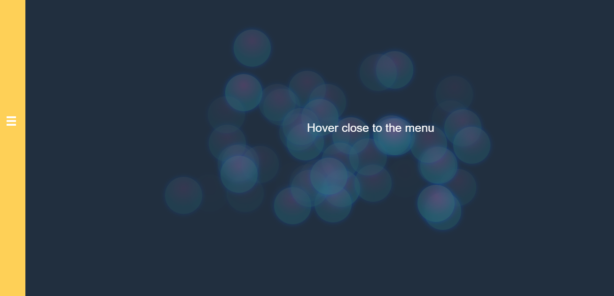
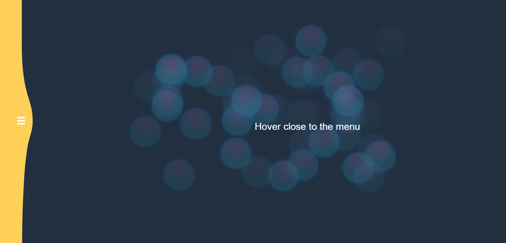
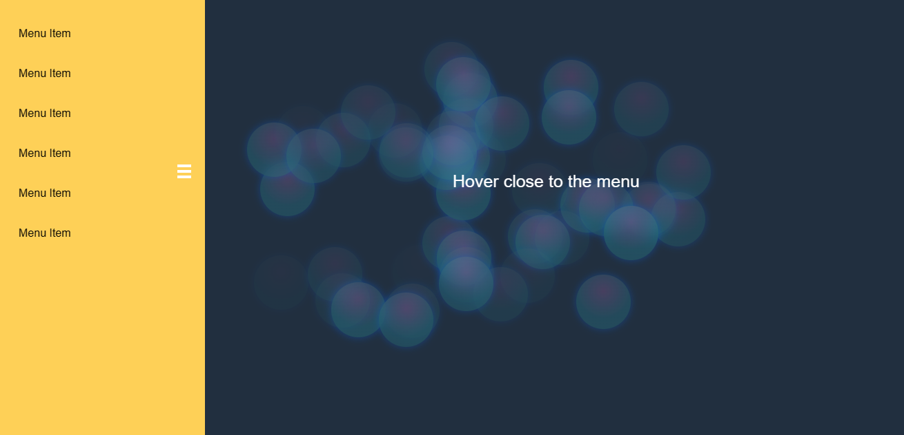

# Interactive Menu with Animated Bubbles

## Application Website

Visit our [Application Website](https://gooey-interactive-menu.vercel.app/) for a live demonstration.

This project consists of an interactive menu with animated bubbles, created to add a dynamic and engaging visual experience to your website. The bubbles are stylized and animated randomly, providing a fun and modern touch to user navigation.

## Features

- **Stylized Bubbles:** Each menu point is represented by a stylized bubble with attractive visual effects.

- **Continuous Animation:** Bubbles move randomly within a central area, providing a smooth and constant animation.

- **Configurable Number of Bubbles:** The quantity of bubbles in the menu can be easily adjusted to fit your site's design.

- **Responsive:** The menu is designed to work responsively across various screen sizes.

## How to Use

1. **Including JavaScript and CSS:**
   - Add the JavaScript code to your file.
   - Add the CSS code to style the bubbles.

```html
<!-- Include this section in the head of your HTML -->
<link rel="stylesheet" href="path-to-your-file.css">

<!-- Include this section at the end of the body of your HTML -->
<script src="path-to-your-file.js"></script>
```

2. **HTML:**
   - Add a container for the menu in your HTML.

```html
<div class="div-container">
    <!-- The menu will be dynamically added here -->
</div>
```

3. **Customization:**
   - Adjust settings in JavaScript and CSS as needed to match your design preferences.

## Benefits

- **Visual Attraction:** Bubble animation adds a visual attraction element to your site, making the user experience more engaging.

- **Easy Customization:** The number of bubbles and other aspects of the menu can be easily customized to fit your site's style.

- **Smooth Integration:** The menu can be seamlessly integrated into any web project, providing a unique experience for visitors.

## Basic Configuration Example

```javascript
// Basic configuration example in your JavaScript file
$(document).ready(function () {
    createBubbles();
    animateBubbles();
});
```

## Example Images






## Contributions

Contributions are welcome! If you encounter issues or have suggestions for improvements, feel free to open an issue or submit a pull request.

## License

This project is licensed under the [MIT License](LICENSE).
Developed by Biasiolo.
